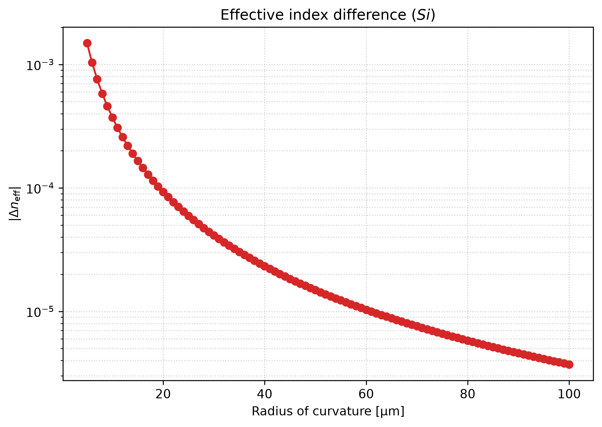

# Low-Loss Waveguide Bends — Radius Optimisation

The 90° bends used to route the MZI arms, and the study that chooses their radius. Modelled
in Lumerical **MODE** with the **FDE** solver, using its built-in bent-waveguide
(conformal-transformation) analysis; the Bézier alternative is explored as a separate
geometry script.

Bends are where a compact photonic circuit spends most of its loss budget, and the MZI needs
several of them to route two matched arms between the splitter and the combiner. This folder
answers two questions: *what radius should the bends be*, and *can a non-circular bend do
better*.

| Parameter | Value |
| --------- | ----- |
| Waveguide | 500 nm × 220 nm Si strip |
| Radius sweep | 4 – 20 µm in 1 µm steps (17 points) |
| Wavelength | 1550 nm |
| Bend angle modelled | 90° (quarter circle) |
| Loss model | mode mismatch (FDE overlap) + propagation over the arc |
| Bézier study | R = 10, δ = 0.01 – 0.45 |

## The two loss mechanisms trade off

Total bend loss is not monotonic in the radius, because two independent contributions pull in
opposite directions:

- **Mode-mismatch loss** comes from the *shape change* the guided mode must undergo. The
  mode of a straight waveguide and the mode of a curved waveguide are not identical — the
  bend pushes the field outward — so at each straight-to-bend interface a fraction of the
  power couples into radiation. The tighter the bend, the larger the mismatch. Here it is
  computed directly: MODE's `overlap` function gives the power coupling between the straight
  mode and each bent mode, and because the light crosses *two* such interfaces (into the bend
  and back out), the loss is taken as `Loss_MM = −10·log₁₀(coupling²)`.
- **Propagation loss** is simply the ordinary loss of the waveguide accumulated over the arc.
  A quarter-circle of radius `R` has length `ℓ = 2πR/4`, so this term **grows linearly with
  the radius**.

The consequence is the point of the sweep: small radii are dominated by mode-mismatch loss,
large radii by propagation loss, and somewhere in between there is a minimum. That minimum is
the radius to use. [`bend_loss_analysis.py`](bend_loss_analysis.py) locates it with `argmin` over the total and prints it;
the sweep window (4–20 µm) is wide enough to bracket it.

## The propagation-loss term

The propagation term is modelled as a *constant* loss per unit length multiplied by the arc
length, taken as **2 dB/cm** in both the sweep and the post-processing and labelled as such
on the figure. That is a simplification: real bend-induced scattering grows as the radius
shrinks, so a constant coefficient understates the penalty on tight bends. The shape of the
curve — mismatch loss falling with `R`, propagation loss rising with `R` — is robust, but the
exact value of `R_opt` should be revisited once a radius-dependent loss term is available.

## How the sweep is built

[`mode_mismatch_Rc_sweep.lsf`](mode_mismatch_Rc_sweep.lsf) sets up the 500 × 220 nm strip in a
4 µm × 4 µm PML window at 1550 nm. It first solves the **straight** guide and copies that mode
to a data card named `radius0`; it then switches on the bent-waveguide analysis and loops over
the radius, and for each radius it

1. re-solves the mode of the curved guide, recording `n_eff` and the shift `|Δn_eff|` relative
   to the straight guide,
2. copies the bent mode to its own card `radius<R>`,
3. calls `overlap('::radius0', '::radius<R>')` to get the straight-to-bend power coupling.

Everything — the radius vector, `|Δn_eff|(R)` and the coupling — is saved to
`neff_Rc_sweep_Si.mat`, which is what the Python side consumes. Watching `|Δn_eff|` versus
radius is a useful cross-check: it grows as the bend tightens, for the same physical reason
that the overlap falls.

## Bézier bends

A circular arc is not the only way to turn a corner, and it is not the best one. The
curvature of a straight-to-arc junction **jumps discontinuously** from 0 (straight) to 1/R
(arc), and it is precisely that discontinuity — not the constant curvature itself — that the
mode cannot follow adiabatically, which is what shows up as mode-mismatch loss.

[`../bezier_curves.py`](../bezier_curves.py) builds a cubic **Bézier** bend as the
alternative. With control points

```
P0 = (0, 0),  P1 = (R(1−δ), 0),  P2 = (R, Rδ),  P3 = (R, R)
```

the script evaluates `B(t)` and its first two derivatives, then the radius of curvature

```
ρ(t) = (x′² + y′²)^{3/2} / |x′y″ − y′x″|
```

and plots `ρ(t)` alongside the constant radius of the reference quarter-arc. For intermediate
values of the shape parameter δ, the curvature **ramps smoothly from 0 up to a minimum and
back to 0**, so the mode is never asked to change shape abruptly — the same idea as an Euler
(spiral) bend. δ = 0 degenerates to a sharp corner and δ = 1 to a purely diagonal control
polygon; the script prints the minimum `ρ/R` reached for each δ so the tightest part of each
curve can be compared directly.

This is a geometry study only — it establishes the shape and its curvature profile, but the
Bézier bend has not yet been put through an FDE or FDTD loss calculation to quantify the
improvement it buys.

## Results




The Bézier geometry study produces its own figure, at the component root:


## Files

| File | Purpose |
| ---- | ------- |
| `mode_mismatch_Rc_sweep.lsf` | Sweeps bend radius 4–20 µm; records `\|Δn_eff\|` and straight↔bend power coupling; writes `neff_Rc_sweep_Si.mat` |
| `bend_loss_analysis.py` | Post-processing: total loss vs radius, optimum radius, and the two result figures |
| `neff_Rc_sweep_Si.mat` | Raw sweep output, consumed by `bend_loss_analysis.py` |
| `bend_loss_vs_radius.png` | Result figure: the two loss contributions, the total, and the optimum radius |
| `bend_neff_shift_vs_radius.png` | Result figure: `\|Δn_eff\|` versus radius |
| `../bezier_curves.py` | Cubic-Bézier bend geometry and curvature profile (component root, not in this folder) |
| `../bezier_curves.png` | Result figure: Bézier bend shapes and their curvature profile |

## Running it

In Lumerical MODE, from this folder:

```lumerical
cd("path/to/Bends/MODE");
addpath("../../shared");   # exposes materials.lsf
mode_mismatch_Rc_sweep;
```

The script calls `materials;`, which lives in the shared folder, so the path must be added
first. It writes `neff_Rc_sweep_Si.mat` to the working directory. The post-processing scripts
address both the data and the output figures with paths relative to the repository root, so
they must be run from there:

```bash
pip install -r requirements.txt
python Bends/MODE/bend_loss_analysis.py
python Bends/bezier_curves.py
```

`bend_loss_analysis.py` prints the optimum radius and total loss, and opens two figures — loss versus radius
(with the optimum marked) and `|Δn_eff|` versus radius.

## See also

- [`../../shared/materials.lsf`](../../shared/materials.lsf) — the Si and SiO₂ models used by
  the sweep.
- [`../../MZI/MMI Theory.md`](../../MZI/MMI%20Theory.md) and
  [`../../MZI/PN Phase Shifter Theory.md`](../../MZI/PN%20Phase%20Shifter%20Theory.md) — the
  project theory notes; the bend loss budget feeds the MZI power balance those notes describe.

## Status

The radius sweep and its post-processing are implemented, and the raw data and figures are
committed. Outstanding items:

- [ ] Replace the constant propagation-loss term with a radius-dependent one (see above).
- [ ] Sweep the Bézier shape parameter δ and compare its mode-mismatch loss against the
  circular arc in FDE, rather than comparing curvature profiles alone.
- [ ] Include the bend in an INTERCONNECT-level loss budget for the full MZI.

## Reference

1. Marcuse, D. (1969). Bending losses of the asymmetric slab waveguide. *Bell System Technical Journal*, 48(7), 2295–2311.
2. Vlasov, Y. A., & McNab, S. J. (2004). Losses in single-mode silicon-on-insulator strip waveguides and bends. *Optics Express*, 12(8), 1622–1631.
3. Chrostowski, L., & Hochberg, M. (2015). *Silicon Photonics Design: From Devices to Systems*. Cambridge University Press, ch. 4.
4. Cherchi, M., Ylinen, S., Harjanne, M., Kapulainen, M., & Aalto, T. (2013). Dramatic size reduction of waveguide bends on a micron-scale silicon photonic platform. *Optics Express*, 21(15), 17814–17823.
