# Silicon-Photonic MZI Modulator on 220 nm SOI

Design and simulation of a silicon-photonic Mach–Zehnder interferometer (MZI) modulator for
BB84 quantum key distribution state encoding: single-mode waveguides, low-loss bends, 1×2
multimode interference (MMI) splitters, and a GHz-bandwidth carrier-depletion phase shifter,
on a commercial 220 nm SOI process.

---

## Platform

Silicon photonics on 220 nm SOI, simulated in Ansys Lumerical (MODE, FDTD, CHARGE, INTERCONNECT),
with gdsfactory and KLayout as the intended layout tools.

| Parameter       | Choice                                       |
| --------------- | -------------------------------------------- |
| Wafer           | SOI, 220 nm Si on 2 µm buried oxide          |
| Process         | IME / AMF / AIM (standard 220 nm SOI)        |
| Wavelength      | 1550 nm (telecom C-band)                     |
| Polarization    | TE (single-mode)                             |
| Modulator type  | Lateral PN junction, carrier depletion       |
| Layout tool     | gdsfactory (Python) or KLayout               |
| PDK             | SiEPIC PDK or foundry PDK if available       |

## Repository structure

Components are grouped by function, and each component gets one sub-directory per solver
used on it — so `<Component>/<Solver>/` holds the design scripts for that solver, its
post-processing, and its own `README.md`.

```
.
├── shared/                     Shared material definitions and helpers
│   ├── materials.lsf           Creates the dispersive Si / SiO2 / SiN models used by all sims
│   └── materials/              Sampled material data (SiN, Palik, Luke, Kischkat, …)
│
├── Waveguide/                  Single-mode strip waveguide (the building block)
│   └── MODE/                   FDE
│       ├── main.lsf            Cross-section and fundamental TE mode
│       ├── width_sweep.lsf     Width sweep → wg_width_sweep.mat
│       ├── width_sweep.py      Post-processing for the width sweep
│       ├── frequency_sweep.lsf Wavelength sweep → frequency_sweep_si.mat
│       ├── frequency_sweep.py  Post-processing for the wavelength sweep
│       └── README.md
│
├── Bends/                      Low-loss waveguide bends
│   ├── bezier_curves.py        Cubic Bézier bends vs circular arcs — curvature analysis
│   └── MODE/                   FDE
│       ├── mode_mismatch_Rc_sweep.lsf  Straight↔bend overlap vs radius of curvature
│       ├── bend_loss_analysis.py       Loss model, optimum radius, figures
│       └── README.md
│
├── MMI/                        1×2 MMI splitter / combiner
│   └── MODE/                   EME
│       ├── main.lsf            Driver; calls step01…step12 in order
│       ├── step01_setup.lsf    Platform constants
│       ├── …
│       ├── step12_dy_sweep.lsf Output-offset sweep, rebuilding the geometry per point
│       ├── length_sweep.py     Post-processing (IL and split vs length)
│       ├── wavelength_sweep.py Post-processing (transmission, IL, imbalance vs λ)
│       ├── dy_sweep.py         Post-processing (IL and imbalance vs d_y)
│       ├── *.mat / *.png       Sweep outputs and the four result figures (all committed)
│       ├── reference/          Superseded varFDTD implementation, kept for cross-checks
│       └── README.md
│
├── PhaseShifter/               Carrier-depletion PN junction
│   ├── CHARGE/                 Drift-diffusion: carrier maps and junction capacitance
│   │   ├── main.lsf            Driver; calls step01…step09 in order
│   │   ├── step01_setup.lsf    Platform constants and design parameters
│   │   ├── …
│   │   ├── depletion_vs_bias.ipynb  Post-processing (W_dep vs bias)
│   │   ├── capacitance_vs_bias.py   Post-processing (C(V), R(V), f_3dB(V))
│   │   ├── charge_sweep.mat    DC sweep output; consumed by the notebook and by MODE/
│   │   ├── ac_sweep.mat        Small-signal AC sweep output
│   │   └── README.md
│   └── MODE/                   FDE: the electro-optic response
│       ├── main.lsf            Driver; calls step01…step05 in order
│       ├── step02_materials.lsf    Carrier maps → np-density grid attribute
│       ├── step05_bias_sweep.lsf   Mode solve per bias point → neff_vs_bias.mat
│       ├── neff_vs_bias.py     Post-processing (n_eff, loss, V_pi·L)
│       └── README.md
│
└── MZI/                        Design notes (Obsidian vault)
    ├── Plan.md
    ├── MMI Theory.md
    └── PN Phase Shifter Theory.md
```

Lumerical project files (`*.lms`, `*.ldev`), logs and movie exports are excluded via
[`.gitignore`](.gitignore) — they are large and machine-specific, and regenerate whenever a
simulation is saved. Simulated data (`*.mat`) and result figures (`*.png`) *are* committed so
results are visible without a Lumerical licence.

## Components

### Single-mode waveguide — `Waveguide/`

The 500 nm × 220 nm strip waveguide that everything else is built on. Solved in Lumerical
MODE (FDE) for the fundamental TE mode, then swept in width and in wavelength to confirm the
single-mode condition holds across the C-band with usable fabrication tolerance.

See [`Waveguide/MODE/README.md`](Waveguide/MODE/README.md).

### Low-loss bends — `Bends/`

Bend loss is the dominant routing penalty once a device has more than a few turns. Two
approaches are compared: a conventional circular arc, whose curvature jumps discontinuously
at the straight-to-bend junction, and a cubic Bézier, whose curvature varies smoothly so the
mode-mismatch loss is lower. The FDE sweep finds the radius that minimises the sum of
mode-mismatch and propagation loss.

See [`Bends/MODE/README.md`](Bends/MODE/README.md).

### 1×2 MMI splitter — `MMI/`

Self-imaging 1×2 multimode interferometer, the 50/50 splitter and combiner of the MZI.
Optimized in Lumerical MODE using the EME (eigenmode expansion) solver, which resolves
the mode-beating physics directly and makes length sweeps essentially free.

Design targets: 50:50 ± 1 %, insertion loss < 0.5 dB, bandwidth > 40 nm, in-phase outputs.

The design point is `W_MMI = 4 µm`, chosen after the output-offset sweep was run at 4 µm and 5 µm
and the 4 µm case gave the lower loss — plausibly because at 4 µm the same taper polygons match the
MMI body better. The analytic sizing at that width is `L_MMI = 3L_π/8 ≈ 19.4 µm`,
`d_y = W_e/4 ≈ 1.04 µm`; an FDE solve replaces the bulk-index beat length (51.7 µm → 39.4 µm), and
three sweeps set the final geometry to `L_MMI = 14.00 µm`, `d_y = 1.019 µm`.

See [`MMI/MODE/README.md`](MMI/MODE/README.md) and
[`MZI/MMI Theory.md`](MZI/MMI%20Theory.md).

### Carrier-depletion phase shifter — `PhaseShifter/`

Lateral PN junction driven in reverse bias. Depleting carriers from the junction region raises
the local refractive index (Soref–Bennett plasma dispersion), shifting the phase of the guided
mode. This is the only component that spans two solvers, so it gets two folders: the electrical
model and the optical one, with a `.mat` carrier map travelling between them.

- **`PhaseShifter/CHARGE/`** — drift-diffusion. Builds the doping profile, sweeps the reverse
  bias and records the carrier distribution at each point, and runs a small-signal AC analysis
  for the junction capacitance and series resistance.
- **`PhaseShifter/MODE/`** — FDE. Imports that carrier map as an np-density grid attribute,
  converts it to a complex index change through a Soref–Bennett perturbation material, and
  solves the optical mode at each bias point to obtain `n_eff(V)` and the loss.

Design targets: V_π·L < 3 V·cm, insertion loss < 5 dB, 3 dB bandwidth > 10 GHz.

See [`PhaseShifter/CHARGE/README.md`](PhaseShifter/CHARGE/README.md),
[`PhaseShifter/MODE/README.md`](PhaseShifter/MODE/README.md) and
[`MZI/PN Phase Shifter Theory.md`](MZI/PN%20Phase%20Shifter%20Theory.md).

## Results so far

### Waveguide

The width sweep runs 100–2000 nm in 50 nm steps and, at each width, records the effective and group indices
and the TE polarisation fraction of every mode it finds. Counting the guided modes per width
locates the single-mode window, and classifying each mode by its polarisation fraction shows
where higher-order and cross-polarised modes appear. The wavelength sweep then fixes the
width at the nominal 500 nm and returns `n_eff(λ)` and `n_g(λ)` across the C-band.

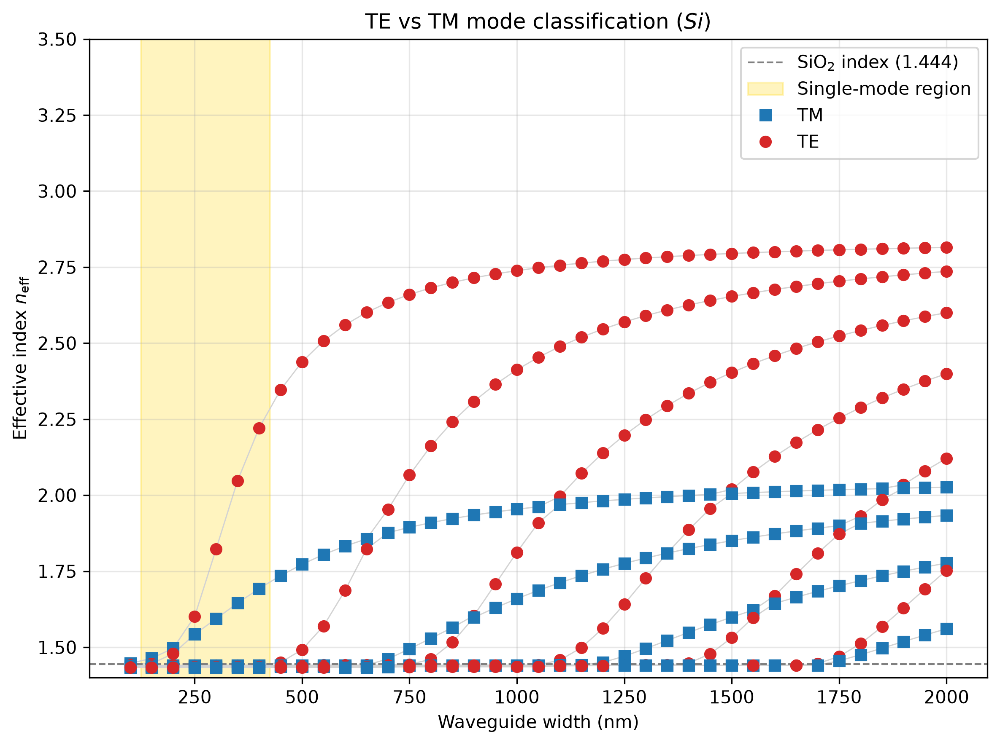

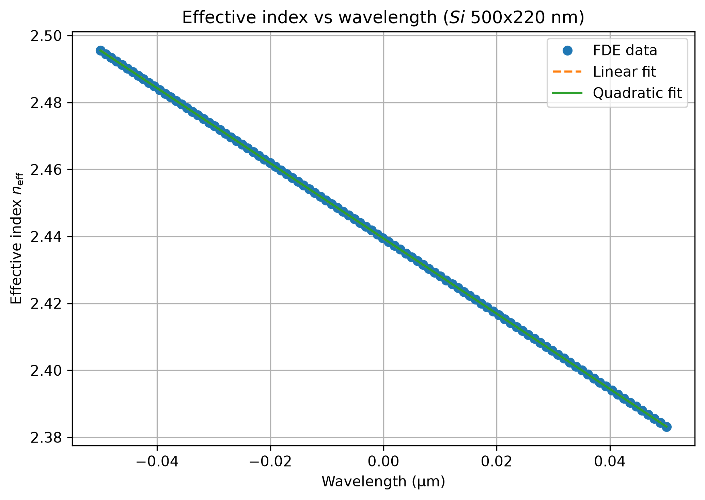

### Bends

Bend loss is a trade-off rather than a monotonic function of radius: the mode-mismatch loss
at the straight-to-bend junctions falls as the radius grows, while the propagation loss over
the arc grows linearly with it. The sweep brackets the minimum.

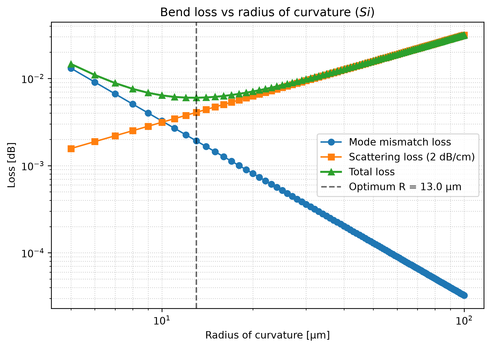

A cubic Bézier bend is the alternative to a circular arc. Its curvature ramps smoothly from
zero, so the mode is never asked to follow the curvature discontinuity that a straight-to-arc
junction presents.

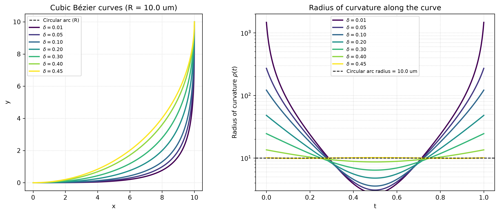

### Phase shifter

The PN junction is modelled in CHARGE on an asymmetric profile (`N_A = 2×10¹⁷`,
`N_D = 1×10¹⁷ cm⁻³`) swept from 0 to −1.5 V. Extracting the depletion width from the carrier
maps gives `W_dep` growing from 152 nm at 0 V to 285 nm at −1.5 V. The closed-form
abrupt-junction result for the same doping is 127 nm → 213 nm, so the simulation follows the
expected `sqrt(V_bi − V)` law but runs 20–34 % wider — the ridge doping is a graded Pearson-IV
implant rather than a uniform step, and the extraction criterion reads roughly a Debye length
beyond the ideal edge. The comparison is worked through in
[`PhaseShifter/CHARGE/README.md`](PhaseShifter/CHARGE/README.md).

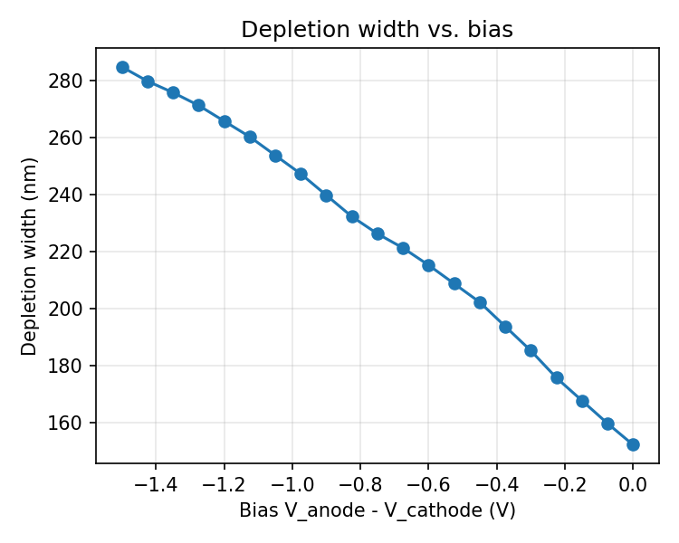

The same junction is then characterised as a capacitor by a small-signal AC sweep. The
capacitance is taken from the low-frequency plateau of `Y(f) = dI/dV` rather than by
differencing charge between DC bias points, because the admittance also carries the series
resistance that the RC bandwidth estimate needs — and because it does not depend on how finely
the bias is stepped. `C(V)` falls monotonically as the depletion region widens, and the
capacitance spectrum shows where the RC roll-off begins.

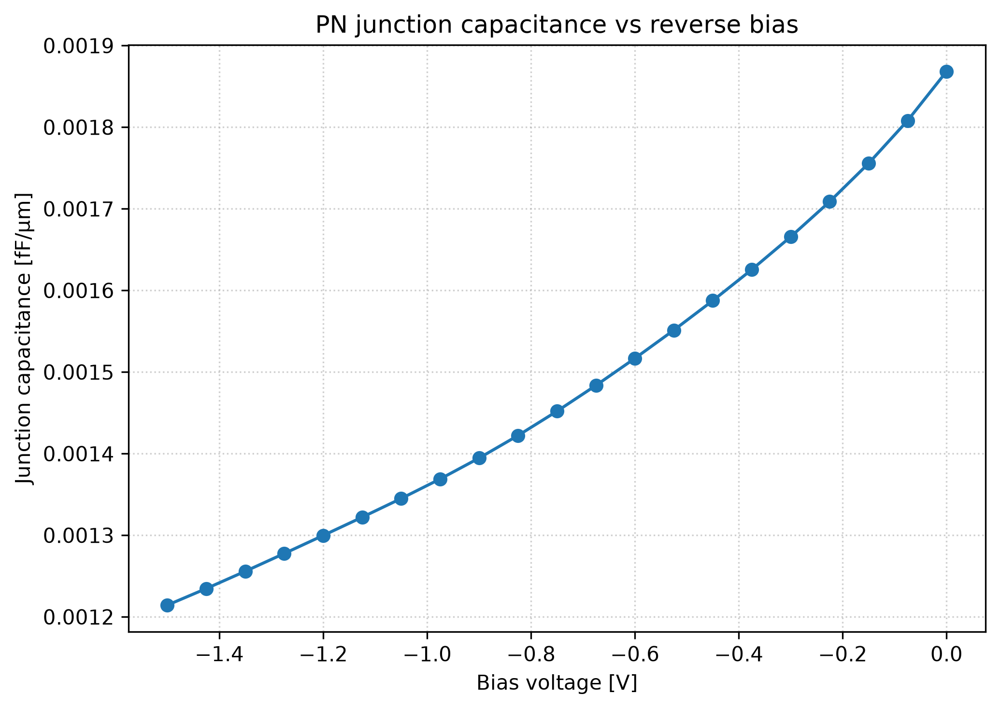

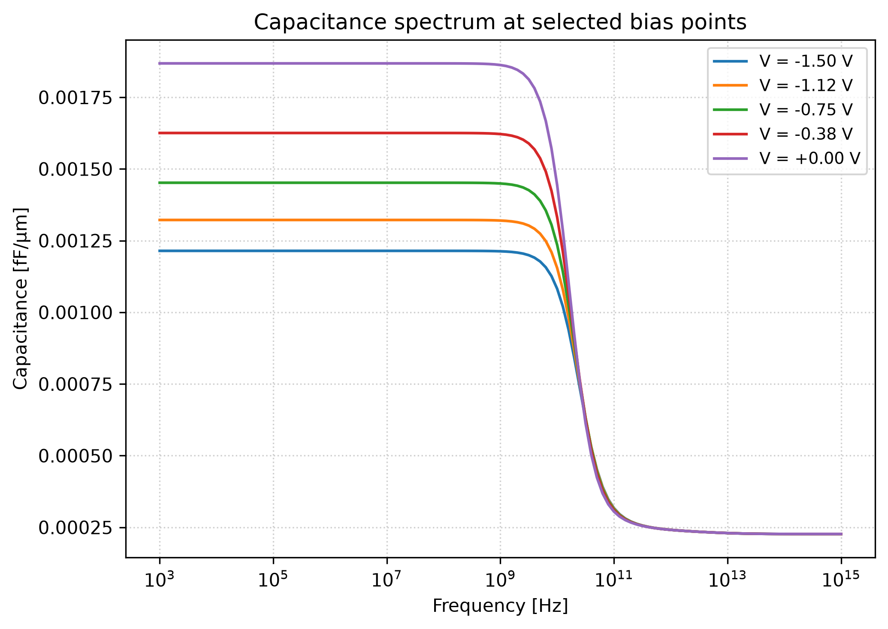

`PhaseShifter/MODE/` closes the loop: importing those carrier maps into the optical model
gives `n_eff(V)`, and hence both the phase shift and the free-carrier loss at each bias. Those
two curves are the whole phase-shifter trade-off — the same carrier removal that raises the
index also absorbs light — so they are deliberately extracted from a single sweep and plotted
against the same bias axis, together with the `V_π·L` figure of merit derived from the slope of
`n_eff(V)`.

The result is `V_π·L = 2.63 V·cm` from the mean slope over the full 0 → −1.5 V swing, inside the
3 V·cm target. The index change over that swing is `Δn_eff = 4.4×10⁻⁵`, and it is strongly
sub-linear in bias — most of the depletion is bought near equilibrium, so the per-interval
`V_π·L` ranges from about 1.9 to 3.7 V·cm across the sweep. Free-carrier loss is 2.3 dB/cm at
−1.5 V rising to 2.9 dB/cm at 0 V, which is 0.3 dB over a 1 mm shifter against a 5 dB device
budget.

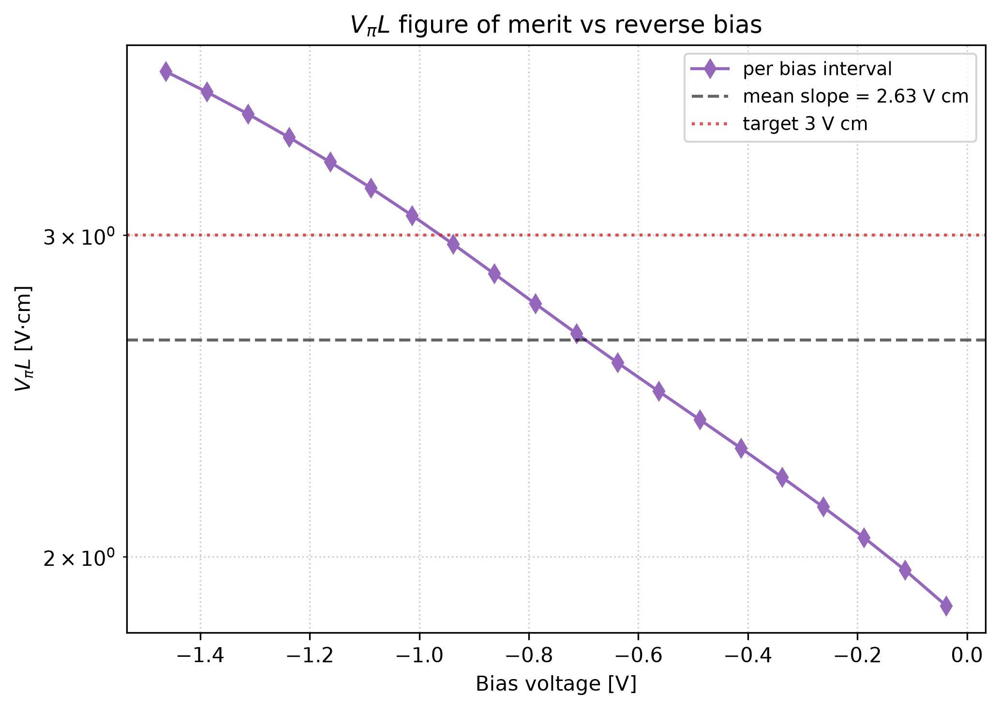

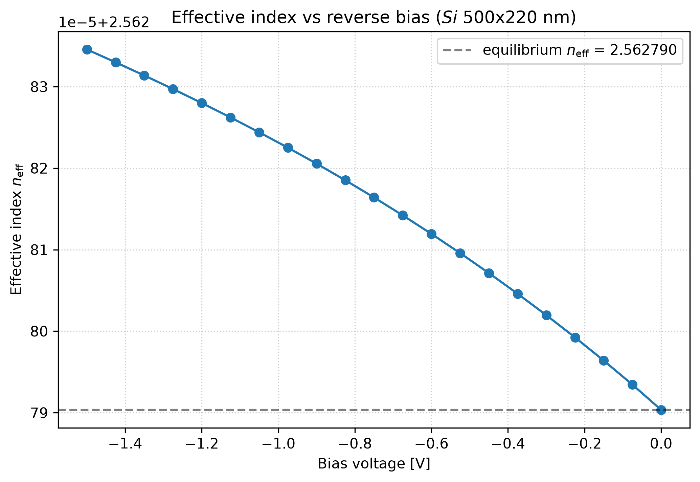

The phase-shifter model is complete and these results are not expected to change.

### MMI

The splitter geometry starts from self-imaging theory — `L_MMI = 3L_π/8`, output ports at
`±W_e/4` — and the EME solver then refines it. An FDE solve replaces the bulk-index guess for
the beat length `L_π`, and a propagation sweep over the MMI body picks the length that
minimises insertion loss. EME is what makes that affordable: changing the MMI length only
changes a propagation phase, so the 31-point sweep runs in seconds rather than the full
rebuild FDTD would need at every point.

Three sweeps set the design, each saved to a `.mat` file by the Lumerical step and turned
into a figure by a Python script:

| Sweep | Saved by | Plotted by | Figure |
| ----- | -------- | ---------- | ------ |
| MMI length | `step09_length_sweep.lsf` | `length_sweep.py` | `mmi_il_vs_length.png` |
| Wavelength (C-band) | `step11_wavelength_sweep.lsf` | `wavelength_sweep.py` | `mmi_transmission_vs_wavelength.png`, `mmi_imbalance_vs_wavelength.png` |
| Output offset `d_y` | `step12_dy_sweep.lsf` | `dy_sweep.py` | `mmi_il_vs_dy.png` |

All three sweeps have now been run, and their outputs and figures are committed.

| Metric | Result |
| ------ | ------ |
| Split at the optimum | 48.6 % / 48.6 % (`T = 0.4864` per port) |
| Imbalance | zero to within 7×10⁻⁹ dB |
| Insertion loss at 1550 nm | **0.120 dB** |
| Insertion loss over 40 nm (1530–1570 nm) | 0.219 dB worst case |
| Insertion loss over the C-band | 0.239 dB mean, 0.501 dB worst (1597 nm) |

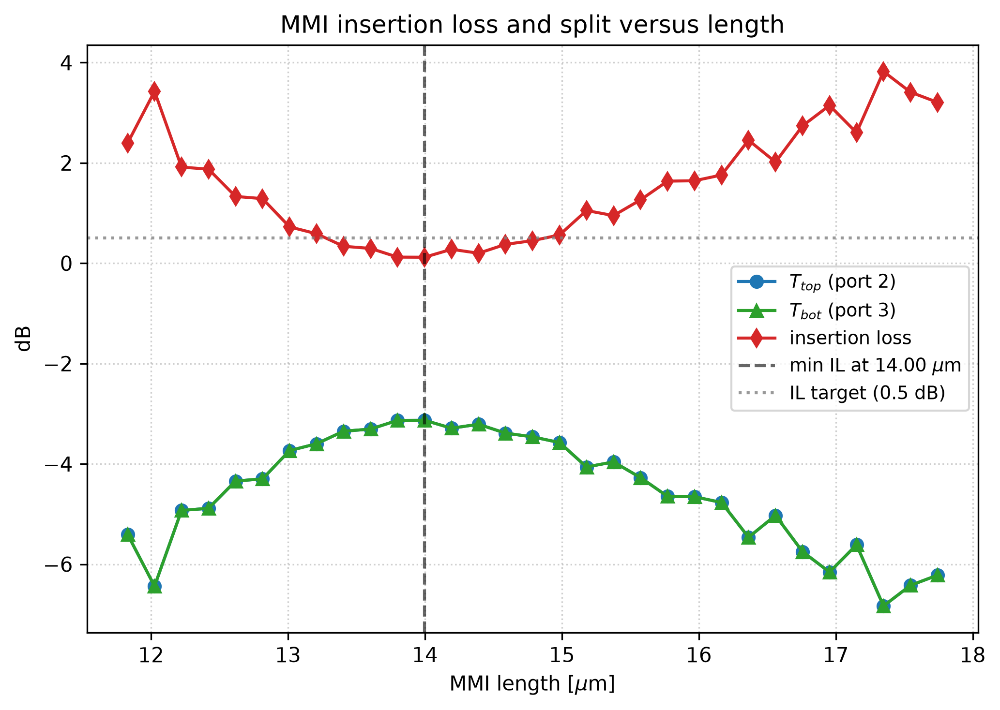

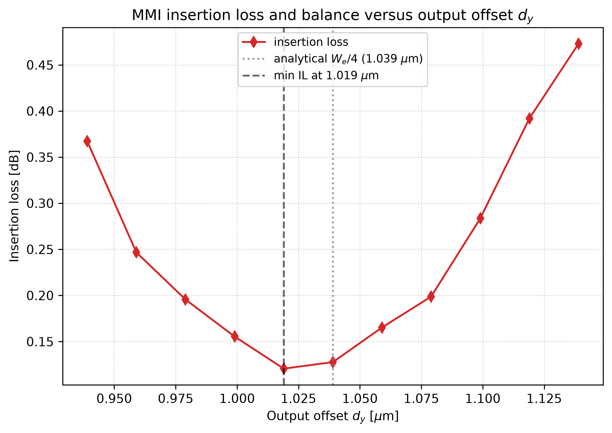

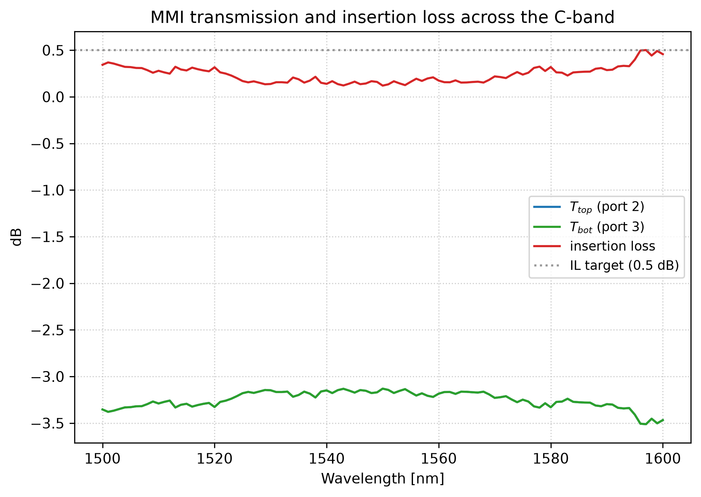

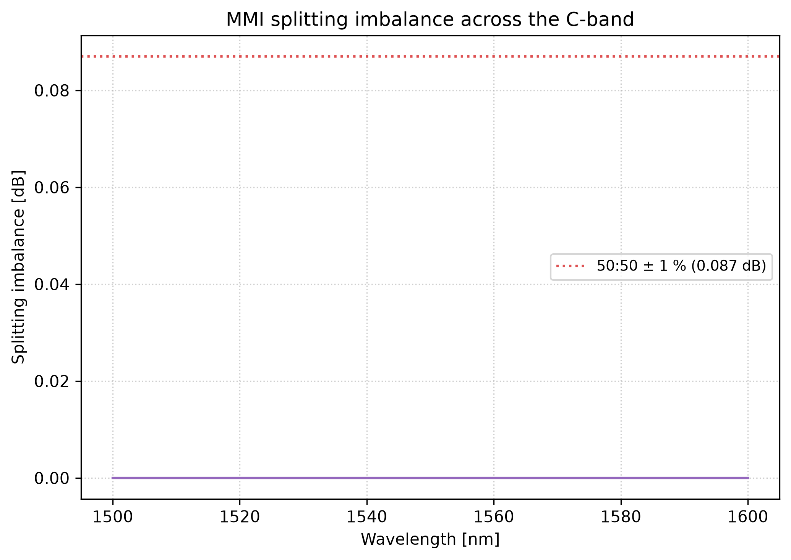

Two features of these curves are worth reading off directly. The imbalance is identically zero,
which is a property rather than a measurement: a centred-input 1×2 MMI with its output ports placed
symmetrically is mirror-symmetric, so `T_top = T_bot` by construction and the curve verifies the
port setup. And the length sweep's minimum is broad and not smooth at the 0.1 dB level, so the
lowest single point is within the solver's own scatter — which is why [`MZI/Plan.md` §5](MZI/Plan.md)
states the selection rule as the band-averaged or worst-case loss over the flat region rather than
the single-point minimum. Closing that gap, along with the taper-length and width-bias checks, is
what remains on this component.

## Running the simulations

Each component/solver folder contains a `main.lsf` driver and a set of numbered step files.
Lumerical's script interpreter does not support `include`, so the step files are written
as script *functions*: the driver calls each by name, and they share a single global
workspace.

In Lumerical MODE or CHARGE:

```lumerical
cd("path/to/MMI/MODE");
main;
```

The driver starts with `switchtolayout` and `deleteall`. Where a component needs the shared
optical materials it issues `addpath("../../shared")` followed by `materials;` before any
geometry is built; the CHARGE flow builds its electrical models from scratch instead and
needs no path setup. Because the step files are called by their base name, a folder has to
be run in place, with `shared/` two levels up. This is why every solver folder sits at
`<Component>/<Solver>/` rather than at the component root — the depth is what makes
`../../shared` resolve.

The post-processing scripts are the other way round: they address their inputs and their
figures from the repository root, so they are run as
`python PhaseShifter/MODE/neff_vs_bias.py` from the top of the tree. The one exception is
`PhaseShifter/CHARGE/depletion_vs_bias.ipynb`, which is opened in its own folder.

To re-run a single stage without rebuilding everything, run the steps individually from the
script prompt, e.g. `step04_fde_mode_check;`.

## Requirements

- Ansys Lumerical 2020 R2 or later, with MODE (FDE + EME) and CHARGE licences enabled
- Python 3.9+ with `numpy`, `h5py`, `matplotlib` for the post-processing scripts

```bash
pip install -r requirements.txt
```

## Status

| Phase | Description                  | Status         |
| ----- | ---------------------------- | -------------- |
| 1     | Waveguide and bend design    | Complete (width and wavelength sweeps, and the bend radius study; the bend `R_opt` is provisional — see [`Bends/MODE/README.md`](Bends/MODE/README.md)) |
| 2     | MMI splitters                | Swept and characterised (length, wavelength and `d_y` sweeps run; 0.120 dB at 1550 nm; figures committed). Taper-width and width-bias robustness checks still open — see [`MZI/Plan.md` §6.1](MZI/Plan.md) |
| 3     | Carrier-depletion modulator  | Complete (depletion width, junction capacitance and electro-optic response all simulated; V_π·L inside target) |
| 4     | MZI system integration       | Not started    |
| 5     | GDS layout                   | Not started    |
| 6     | Documentation and repository | In progress    |

## References

1. Soldano, L. B., & Pennings, E. C. M. (1995). Optical multi-mode interference devices based on self-imaging. *J. Lightwave Technol.*, 13(4), 615–627.
2. Soref, R. A., & Bennett, B. R. (1987). Electrooptical effects in silicon. *IEEE J. Quantum Electron.*, 23(1), 123–129.
3. Reed, G. T., Mashanovich, G., Gardes, F. Y., & Thomson, D. J. (2010). Silicon optical modulators. *Nature Photonics*, 4(8), 518–526.
4. Chrostowski, L., & Hochberg, M. (2015). *Silicon Photonics Design: From Devices to Systems*. Cambridge University Press.
5. Bennett, C. H., & Brassard, G. (1984). Quantum cryptography: Public key distribution and coin tossing. *Proc. IEEE ICCSSP*.
