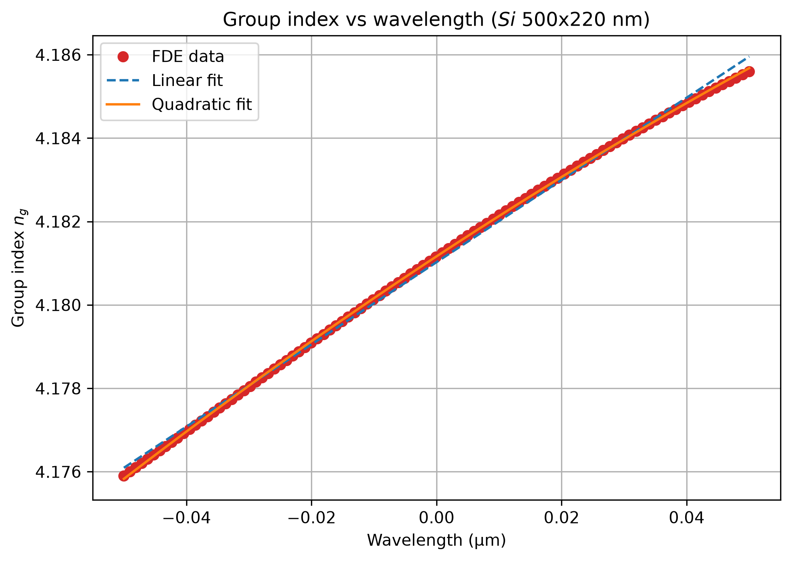

# 500 × 220 nm Strip Waveguide — Design and Characterisation

The single-mode silicon strip waveguide that every other component in the project is built
from. Designed and characterised in Lumerical **MODE** using the **FDE**
(finite-difference eigenmode) solver.

Every other component assumes this cross-section: the MMI splitter takes it as its
input/output guide, the carrier-depletion phase shifter is formed in it, and the routing
bends are bends *of* it. The scripts in this folder fix the geometry and extract the optical
constants the rest of the design depends on — the effective index `n_eff`, the group index
`n_g`, the polarisation of each mode, and the width at which the waveguide stops being
single-mode.

| Target | Value |
| ------ | ----- |
| Cross-section | 500 nm wide × 220 nm thick Si |
| Stack | Si on SiO₂ BOX, SiO₂ upper cladding |
| Polarisation | TE, single-mode |
| Operating wavelength | 1550 nm (telecom C-band) |
| Width sweep | 100 – 2000 nm in 50 nm steps (39 points) |
| Dispersion sweep | 1500 – 1600 nm, 100 points |

## Why 500 nm, and why it is close to the single-mode cutoff

The obvious place to start is the vertical direction, and it turns out to be the tightest
constraint. At 1550 nm a bare 220 nm silicon slab has a normalised frequency of only
V ≈ 2.8 — below the π that marks the second vertical mode. The 220 nm height therefore
carries a *single* TE-like vertical mode, but only just: it is close to its own single-mode
limit.

Because the vertical confinement is fixed at 220 nm and is already near that limit, the
**lateral width alone decides how many modes the strip supports.** Two effects pull the
width in opposite directions:

- **Increasing the width** confines the mode more tightly, which lowers the field amplitude
  at the etched sidewalls and therefore reduces sidewall-roughness scattering loss. Push too
  far, however, and the second-order lateral TE mode stops being cut off and the guide
  becomes multi-mode.
- **Decreasing the width** keeps the guide single-mode with margin, but weakens the lateral
  confinement: more of the field sits in the oxide, the mode is more sensitive to a ±10 nm
  width error, and scattering loss rises.

500 nm is the conventional compromise on a 220 nm platform — wide enough for good
confinement and low loss, yet at or near the point where the second-order TE mode appears.
That is why the same number appears as `wg_width` throughout the repository. The analytical
V-number argument only estimates this boundary; the FDE sweep below is what actually locates
it for this material stack, and the four consequences — single-mode condition, propagation
loss, fabrication tolerance, and the `n_eff` values handed to every later stage — are what
make it worth measuring rather than assuming.

## What the width sweep measures

[`width_sweep.lsf`](width_sweep.lsf) builds the same cross-section and sweeps `wg_width`
from 100 nm to 2000 nm in 50 nm steps (39 points). At each width it runs `findmodes` for up
to 10 trial modes and records, per mode, the effective index `n_eff`, the group index `n_g`
and the **TE polarisation fraction**. The results are written to `wg_width_sweep.mat`, and
the script also plots `n_eff` and the TE fraction against width. Compared with
`main.lsf` the sweep uses a tighter 10 µm window with metal walls instead of a 20 µm
window with PML — a deliberate speed/padding trade-off, since the solve is repeated 39 times.

The post-processing script [`width_sweep.py`](width_sweep.py) turns the raw arrays into the
design picture:

- it masks entries where no mode was found (`n_eff ≈ 0`);
- it counts the guided modes per width as those with `n_eff` above the oxide index (1.444)
  and **shades the width band in which only two modes are guided** — the single-mode region
  on the plot;
- it classifies every mode as **TE** (TE fraction > 0.5), **TM** (< 0.5) or **hybrid**, so
  the onset of higher-order and cross-polarised modes is visible at a glance;
- it prints the guided-mode count width by width, so the single-mode boundary in the shaded
  band can be checked against the raw count rather than taken on trust.

## Dispersion across the C-band

[`frequency_sweep.lsf`](frequency_sweep.lsf) fixes the width at 500 nm and sweeps the
wavelength from 1500 nm to 1600 nm in 100 points with the detailed-dispersion option
enabled and mode tracking on. It extracts `n_eff(λ)` and the group velocity `v_g`, from
which the **group index `n_g = c / v_g`** is obtained, and does two things with them:

- it writes `waveguide_si_500x220.ldf`, a data card of `n_eff` and loss versus frequency
  that INTERCONNECT reads as the compact model of the waveguide in the MZI system
  simulation;
- it saves `frequency_sweep_si.mat` for post-processing.

[`frequency_sweep.py`](frequency_sweep.py) plots `n_eff` and `n_g` against wavelength and
fits both a linear and a quadratic polynomial, printing the coefficients. The dispersion
matters beyond book-keeping: the MZI's free spectral range and the modulator's phase
response both depend on the group index, so `n_g(λ)` is the number that ultimately sets how
the four BB84 phase states map onto drive voltages.

## Results

The width sweep, with the single-mode band shaded and each mode coloured by its polarisation
fraction. The count of guided modes per width is what defines the shaded region; the
classification is what shows where the higher-order and cross-polarised modes appear.


The dispersion sweeps at the nominal 500 nm width, with linear and quadratic fits:




## Files

| File | Purpose |
| ---- | ------- |
| `main.lsf` | Reference setup: builds the 500 × 220 nm cross-section and configures the FDE solver (PML, 20 µm window, 10 trial modes) |
| `width_sweep.lsf` | Sweeps `wg_width` 100–2000 nm in 50 nm steps; records `n_eff`, `n_g` and TE fraction per mode; writes `wg_width_sweep.mat` |
| `width_sweep.py` | Post-processing: single-mode band, TE/TM/hybrid classification |
| `frequency_sweep.lsf` | Sweeps 1500–1600 nm; writes the INTERCONNECT data card and `frequency_sweep_si.mat` |
| `frequency_sweep.py` | Post-processing: `n_eff(λ)` and `n_g(λ)` with linear and quadratic fits |
| `waveguide_si_500x220.ldf` | INTERCONNECT data card for the 500 × 220 nm Si waveguide |
| `wg_width_sweep.mat` | Raw width-sweep output, consumed by `width_sweep.py` |
| `frequency_sweep_si.mat` | Raw frequency-sweep output, consumed by `frequency_sweep.py` |
| `waveguide_modes_vs_width.png` | Result figure: guided modes vs width, coloured by polarisation |
| `waveguide_neff_vs_wavelength.png` | Result figure: `n_eff(λ)` with linear and quadratic fits |
| `waveguide_ng_vs_wavelength.png` | Result figure: `n_g(λ)` with linear and quadratic fits |

As elsewhere in the repository, the `.lsf` scripts are the *design* scripts and the `.py`
scripts are *post-processing*: nothing is computed in Python that the solver has not already
produced.

## Running it

In Lumerical MODE, from this folder:

```lumerical
cd("path/to/Waveguide/MODE");
addpath("../../shared");   # exposes materials.lsf
width_sweep;               # or frequency_sweep;
```

Both scripts call `materials;` to create the dispersive silicon and constant-index oxide
models. That function lives in the shared folder, so `addpath("../../shared")` (or an
equivalent working-directory setting) must be issued first.

The sweeps write their `.mat` files to the working directory. The post-processing scripts
address both the data and the output figures with paths relative to the repository root, so
they must be run from there:

```bash
pip install -r requirements.txt
python Waveguide/MODE/width_sweep.py
python Waveguide/MODE/frequency_sweep.py
```

## See also

- [`../../shared/materials.lsf`](../../shared/materials.lsf) — the Si and SiO₂ models these
  simulations run on.
- [`../../MZI/MMI Theory.md`](../../MZI/MMI%20Theory.md) — the MMI's effective-width and
  beat-length formulas take this waveguide as their input guide.
- [`../../MZI/PN Phase Shifter Theory.md`](../../MZI/PN%20Phase%20Shifter%20Theory.md) — the
  phase shifter is formed in exactly this cross-section; the mode profile computed here is
  what its Δn_eff overlap integral is taken against.

## Reference

1. Chrostowski, L., & Hochberg, M. (2015). *Silicon Photonics Design: From Devices to Systems*. Cambridge University Press, ch. 4.
2. Vlasov, Y. A., & McNab, S. J. (2004). Losses in single-mode silicon-on-insulator strip waveguides and bends. *Optics Express*, 12(8), 1622–1631.
3. Payne, F. P., & Lacey, J. P. R. (1994). A theoretical analysis of scattering loss from planar optical waveguides. *Optical and Quantum Electronics*, 26(10), 977–986.
4. Soref, R. A., Schmidtchen, J., & Petermann, K. (1991). Large single-mode rib waveguides in GeSi-Si and Si-on-SiO₂. *IEEE Journal of Quantum Electronics*, 27(8), 1971–1974.
